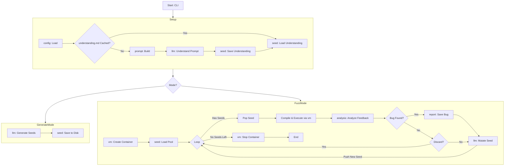

# DeFuzz - High-Level Code Plan

This document provides a high-level overview of the DeFuzz project, its architecture, and the interaction between its different modules. It is intended to be a guide for developers to understand the overall design and workflow.

## 1. Core Objective

DeFuzz is an AI-driven fuzzer designed to find bugs in software defense strategies. It uses a Large Language Model (LLM) to generate, mutate, and analyze test cases (seeds) to discover vulnerabilities in a target compiler's defense mechanisms.

## 2. Core Components & Workflow

The application operates in two primary modes: `generate` and `fuzz`. The overall workflow is orchestrated by the `fuzz` package, which acts as the central controller.

### Component Interaction Flow

## 3. Module Responsibilities & Dependencies

The project is divided into several internal packages, each with a specific responsibility.

- **`cmd/defuzz`**:

  - **Responsibility**: The application's entry point. Parses command-line flags (`-mode`, `-isa`, etc.) and calls the `fuzz` package to start the appropriate workflow.
  - **Dependencies**: `internal/fuzz`

- **`internal/fuzz`** (Orchestrator):

  - **Responsibility**: The central controller. Manages the high-level logic for both modes. It handles the caching logic for the LLM's understanding, initializes the `vm`, and orchestrates the main fuzzing loop.
  - **Dependencies**: `config`, `prompt`, `llm`, `seed`, `compiler`, `vm`, `analysis`, `report`

- **`internal/config`**:

  - **Responsibility**: Loads and provides access to configuration from YAML files in the `/configs` directory (e.g., `llm.yaml`).
  - **Dependencies**: None

- **`internal/prompt`**:

  - **Responsibility**: Constructs the detailed initial prompts for the LLM, combining information about the target ISA, defense strategy, and toolchain.
  - **Dependencies**: None

- **`internal/llm`**:

  - **Responsibility**: Manages all communication with the LLM. It processes the initial prompt to get an "understanding", generates seeds, analyzes feedback, and mutates seeds.
  - **Dependencies**: `config`, `seed`

- **`internal/seed`**:

  - **Responsibility**: Defines the data structure for a "seed". Manages the seed pool and handles saving/loading of seeds and the cached `understanding.md` file.
  - **Dependencies**: None

- **`internal/compiler`**:

  - **Responsibility**: Determines the correct compilation command for a given seed. It does _not_ execute the command itself but rather requests the `vm` module to run the command.
  - **Dependencies**: `vm`

- **`internal/vm`**:

  - **Responsibility**: Manages the lifecycle of the sandboxed container environment (e.g., using Podman). It creates the container at the start and provides functions to run arbitrary commands _inside_ it. It uses the `exec` module to make the `podman` calls on the host.
  - **Dependencies**: `exec`

- **`internal/exec`**:

  - **Responsibility**: A low-level utility package for executing shell commands on the host. It is unaware of containers or the specifics of the commands it runs.
  - **Dependencies**: None

- **`internal/analysis`**:

  - **Responsibility**: Interprets the feedback from a VM execution to determine if a bug has occurred. This logic may eventually be assisted by the LLM.
  - **Dependencies**: None

- **`internal/report`**:
  - **Responsibility**: Saves detailed information about discovered bugs to disk for later review.
  - **Dependencies**: None

## 4. Data Flow

1.  **Configuration & Setup**:

    - The `fuzz` orchestrator loads settings from the `config` package.
    - It checks for a cached `understanding.md` in the appropriate `initial_seeds/<isa>/<strategy>/` directory.
    - **Cache Miss**: If the file doesn't exist, it uses the `prompt` module to build the initial prompt, has the `llm` process it, and then uses the `seed` module to save the result to `understanding.md`.
    - **Cache Hit**: If the file exists, it's loaded directly, saving an expensive LLM call. This understanding is used as the context for the rest of the session.

2.  **Generate Mode**:

    - The `llm` is asked to generate initial seeds based on the established context.
    - The `seed` module saves these to the `initial_seeds/` directory.

3.  **Fuzz Mode**:
    - **Setup**: The `fuzz` orchestrator initializes the `vm` module, which creates and starts a persistent container for the fuzzing session.
    - **Loop Start**: `seed` loads the initial seeds into an in-memory pool.
    - **Compilation**: `compiler` determines the correct build command for a seed and asks `vm` to execute it inside the container.
    - **Execution**: The `fuzz` orchestrator asks `vm` to run the newly compiled binary inside the container.
    - **Analysis**: The execution result (stdout, stderr, exit code) is captured by `vm` and passed to `analysis`. The `llm` may be consulted here, using its established context.
    - **Reporting & Mutation**: If a bug is found, `report` saves it. The `llm` is then used to mutate the seed, and the new variant is added back to the pool.
    - The loop continues until a bug quota is met or the seed pool is empty.
    - **Cleanup**: The `fuzz` orchestrator directs the `vm` to stop and remove the container.
