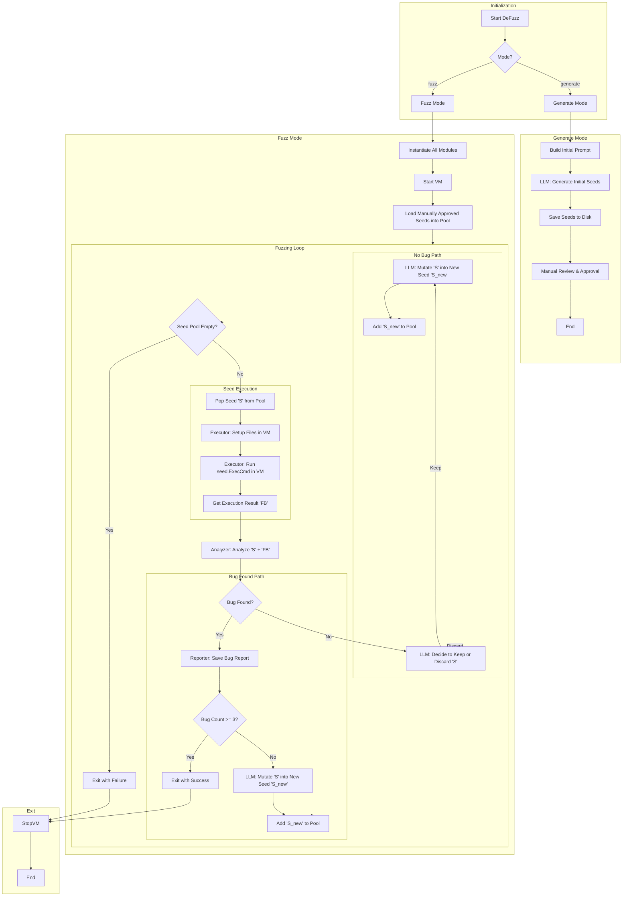

# DeFuzz Workflow

This document contains a Mermaid flowchart that illustrates the complete workflow of the DeFuzz application, from initialization to the core fuzzing loop.

```mermaid
graph TD
    subgraph Initialization
        A[Start DeFuzz] --> B{Mode?};
        B -->|generate| C[Generate Mode];
        B -->|fuzz| D[Fuzz Mode];
    end

    subgraph Generate Mode
        C --> C1[Build Initial Prompt];
        C1 --> C2[LLM: Generate Initial Seeds];
        C2 --> C3[Save Seeds to Disk];
        C3 --> C4[Manual Review & Approval];
        C4 --> EndGenerate[End];
    end

    subgraph Fuzz Mode
        D --> D1[Instantiate All Modules];
        D1 --> D2[Start VM];
        D2 --> D3[Load Manually Approved Seeds into Pool];
        D3 --> FuzzLoop;
    end

    subgraph FuzzLoop [Fuzzing Loop]
        FuzzLoop --> L1{Seed Pool Empty?};
        L1 -->|Yes| ExitFail[Exit with Failure];
        L1 -->|No| L2[Pop Seed 'S' from Pool];

        subgraph SeedExecution [Seed Execution]
            L2 --> E1[Executor: Setup Files in VM];
            E1 --> E2[Executor: Run seed.ExecCmd in VM];
            E2 --> E3[Get Execution Result 'FB'];
        end

        E3 --> L3[Analyzer: Analyze 'S' + 'FB'];
        L3 --> L4{Bug Found?};

        subgraph BugFound [Bug Found Path]
            L4 -->|Yes| B1[Reporter: Save Bug Report];
            B1 --> B2{Bug Count >= 3?};
            B2 -->|Yes| ExitSuccess[Exit with Success];
            B2 -->|No| B3[LLM: Mutate 'S' into New Seed 'S_new'];
            B3 --> B4[Add 'S_new' to Pool];
            B4 --> FuzzLoop;
        end

        subgraph NoBugFound [No Bug Path]
            L4 -->|No| N1[LLM: Decide to Keep or Discard 'S'];
            N1 -->|Discard| FuzzLoop;
            N1 -->|Keep| N2[LLM: Mutate 'S' into New Seed 'S_new'];
            N2 --> N3[Add 'S_new' to Pool];
            N3 --> FuzzLoop;
        end
    end

    subgraph Exit
        ExitSuccess --> StopVM;
        ExitFail --> StopVM;
        StopVM --> FinalEnd[End];
    end

```
